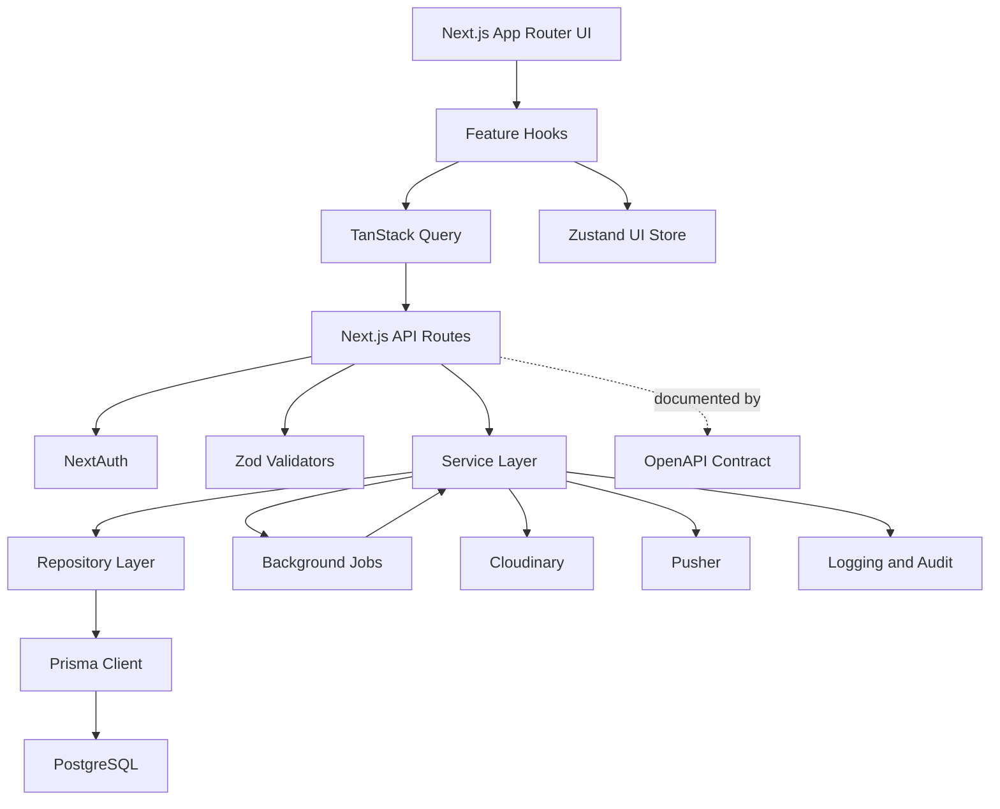

# CoFoundr Project Architecture

This document defines the project architecture, folder structure, service layer organization, development conventions, and implementation standards for CoFoundr.

It does not modify the finalized database architecture, Prisma schema, or backend API architecture. It does not include frontend or backend implementation code.

## 1. Complete Folder Structure

```text
cofoundr/
├── .github/
│   └── workflows/
│       ├── ci.yml
│       └── preview.yml
├── docs/
│   ├── database-architecture.md
│   ├── api-architecture.md
│   └── project-architecture.md
├── prisma/
│   ├── schema.prisma
│   ├── seed.ts
│   ├── seed/
│   │   ├── communities.seed.ts
│   │   ├── industries.seed.ts
│   │   ├── skills.seed.ts
│   │   └── milestones.seed.ts
│   └── migrations/
├── public/
│   ├── images/
│   └── icons/
├── src/
│   ├── app/
│   │   ├── (auth)/
│   │   ├── (dashboard)/
│   │   ├── (marketing)/
│   │   ├── api/
│   │   ├── globals.css
│   │   ├── layout.tsx
│   │   └── providers.tsx
│   ├── components/
│   │   ├── ui/
│   │   ├── layout/
│   │   ├── navigation/
│   │   ├── cards/
│   │   ├── forms/
│   │   ├── feedback/
│   │   ├── media/
│   │   └── data-display/
│   ├── features/
│   │   ├── auth/
│   │   ├── profile/
│   │   ├── startup/
│   │   ├── opportunity/
│   │   ├── discovery/
│   │   ├── match/
│   │   ├── messaging/
│   │   ├── notification/
│   │   ├── verification/
│   │   ├── reputation/
│   │   ├── review/
│   │   ├── follow/
│   │   ├── saved/
│   │   ├── application/
│   │   ├── analytics/
│   │   └── admin/
│   ├── services/
│   │   ├── auth/
│   │   ├── profile/
│   │   ├── startup/
│   │   ├── opportunity/
│   │   ├── discovery/
│   │   ├── match/
│   │   ├── messaging/
│   │   ├── notification/
│   │   ├── verification/
│   │   ├── reputation/
│   │   ├── review/
│   │   ├── follow/
│   │   ├── saved/
│   │   ├── application/
│   │   ├── analytics/
│   │   ├── search/
│   │   └── admin/
│   ├── repositories/
│   │   ├── user.repository.ts
│   │   ├── profile.repository.ts
│   │   ├── startup.repository.ts
│   │   ├── opportunity.repository.ts
│   │   ├── match.repository.ts
│   │   ├── message.repository.ts
│   │   ├── notification.repository.ts
│   │   ├── application.repository.ts
│   │   └── analytics.repository.ts
│   ├── jobs/
│   │   ├── notification.job.ts
│   │   ├── analytics.job.ts
│   │   └── reputation.job.ts
│   ├── docs/
│   │   └── openapi.yaml
│   ├── lib/
│   │   ├── auth/
│   │   ├── cloudinary/
│   │   ├── db/
│   │   ├── errors/
│   │   ├── http/
│   │   ├── logger/
│   │   ├── pusher/
│   │   ├── rate-limit/
│   │   ├── security/
│   │   └── validation/
│   ├── hooks/
│   ├── store/
│   ├── types/
│   ├── validators/
│   ├── constants/
│   ├── utils/
│   ├── middleware.ts
│   └── instrumentation.ts
├── tests/
│   ├── unit/
│   ├── integration/
│   ├── api/
│   ├── e2e/
│   ├── fixtures/
│   └── setup/
├── .env.example
├── components.json
├── next.config.ts
├── package.json
├── postcss.config.mjs
├── tailwind.config.ts
├── tsconfig.json
└── vitest.config.ts
```

## 2. Feature-Based Architecture

Each feature owns its UI-facing orchestration, hooks, local components, query keys, and feature-specific types. Shared business logic belongs in `src/services`, not inside components.

```text
src/features/auth/
├── components/
├── hooks/
├── queries/
├── types.ts
└── index.ts

src/features/profile/
├── components/
├── hooks/
├── queries/
├── forms/
├── types.ts
└── index.ts

src/features/startup/
├── components/
├── hooks/
├── queries/
├── forms/
├── types.ts
└── index.ts

src/features/opportunity/
├── components/
├── hooks/
├── queries/
├── forms/
├── types.ts
└── index.ts

src/features/discovery/
├── components/
├── hooks/
├── queries/
├── swipe-deck/
├── types.ts
└── index.ts

src/features/match/
├── components/
├── hooks/
├── queries/
├── types.ts
└── index.ts

src/features/messaging/
├── components/
├── hooks/
├── queries/
├── composer/
├── thread/
├── types.ts
└── index.ts

src/features/notification/
├── components/
├── hooks/
├── queries/
├── types.ts
└── index.ts

src/features/verification/
src/features/reputation/
src/features/review/
src/features/follow/
src/features/saved/
src/features/application/
src/features/analytics/
src/features/admin/
```

Feature rules:

- Feature components may call feature hooks.
- Feature hooks may call API clients and React Query mutations.
- Feature code must not import Prisma directly.
- Cross-feature business workflows belong in `src/services`.
- Shared primitives go to `src/components`, not a feature folder.

## 3. Backend Service Layer

Services contain business rules, transactions, authorization checks, side effects, and integration boundaries. API routes should stay thin: authenticate, validate, call service, return response.

```text
src/services/auth/
├── auth.service.ts
├── session.service.ts
├── password.service.ts
├── oauth.service.ts
└── auth.policy.ts

src/services/profile/
├── profile.service.ts
├── skill.service.ts
├── experience.service.ts
├── education.service.ts
├── portfolio.service.ts
└── founder-vision.service.ts

src/services/startup/
├── startup.service.ts
├── startup-member.service.ts
├── startup-media.service.ts
└── startup.policy.ts

src/services/opportunity/
├── opportunity.service.ts
├── opportunity-skill.service.ts
└── opportunity.policy.ts

src/services/discovery/
├── discovery.service.ts
├── swipe.service.ts
├── feed-ranking.service.ts
└── discovery.policy.ts

src/services/match/
├── match.service.ts
├── user-match.service.ts
├── startup-match.service.ts
├── opportunity-match.service.ts
└── match.policy.ts

src/services/messaging/
├── conversation.service.ts
├── message.service.ts
├── attachment.service.ts
├── read-receipt.service.ts
└── messaging.policy.ts

src/services/notification/
├── notification.service.ts
├── notification-template.service.ts
└── notification-delivery.service.ts

src/services/verification/
├── verification.service.ts
├── user-verification.service.ts
├── startup-verification.service.ts
└── verification.policy.ts

src/services/reputation/
├── reputation.service.ts
├── builder-score.service.ts
├── trust-score.service.ts
├── collaboration-score.service.ts
└── milestone.service.ts

src/services/analytics/
├── analytics.service.ts
├── event-ingestion.service.ts
└── metrics.service.ts

src/services/search/
├── search.service.ts
├── filter.service.ts
└── ranking.service.ts

src/services/admin/
├── admin.service.ts
├── moderation.service.ts
├── report.service.ts
└── audit.service.ts
```

Service conventions:

- Service files end in `.service.ts`.
- Authorization helpers end in `.policy.ts`.
- Services accept validated inputs only.
- Services return typed domain results, not raw HTTP responses.
- Services depend on repositories for persistence and do not import Prisma directly.
- Cross-table writes use Prisma transactions.
- Side effects such as notifications, analytics, Pusher events, and email should be idempotent.

### Search service responsibilities

- `search.service.ts`: orchestrates global search across users, startups, opportunities, and future indexed resources.
- `filter.service.ts`: owns industry, location, startup, user, availability, status, and opportunity filters.
- `ranking.service.ts`: owns compatibility ranking, discovery ranking, and recommendation ranking.

Search should start with repository-backed PostgreSQL queries and evolve toward a dedicated search index when ranking, typo tolerance, faceting, or query volume outgrow relational queries.

## 3A. Repository Layer

The data access flow is:

```text
API Route
  -> Service
  -> Repository
  -> Prisma
  -> PostgreSQL
```

```text
src/repositories/
├── user.repository.ts
├── profile.repository.ts
├── startup.repository.ts
├── opportunity.repository.ts
├── match.repository.ts
├── message.repository.ts
├── notification.repository.ts
├── application.repository.ts
└── analytics.repository.ts
```

Repository responsibilities:

- Own all Prisma queries and model-specific persistence concerns.
- Encapsulate query shape, includes/selects, pagination clauses, and transaction-aware database access.
- Return typed persistence results to services.
- Hide Prisma-specific details from services where practical.
- Provide focused methods such as find-by-id, list-for-user, create, update, soft-delete, and domain-specific query helpers.

Service-to-repository interaction guidelines:

- API routes never import Prisma or repositories directly; routes call services.
- Services never import Prisma directly; services depend on repositories.
- Services own business rules, authorization decisions, transactions, workflow orchestration, and side-effect decisions.
- Repositories must not contain product policy, authorization, notification, scoring, or workflow orchestration.
- For multi-write workflows, services open the transaction and pass the transaction client/context to repositories.
- Repository interfaces should be easy to mock in unit tests and replace if persistence changes later.

## 4. API Route Structure

```text
src/app/api/
├── auth/
│   ├── [...nextauth]/route.ts
│   ├── session/route.ts
│   ├── logout/route.ts
│   └── password/
│       ├── forgot/route.ts
│       └── reset/route.ts
├── users/
│   ├── route.ts
│   └── me/route.ts
├── profiles/
│   ├── me/route.ts
│   ├── [userId]/route.ts
│   ├── skills/route.ts
│   ├── experience/[experienceId]/route.ts
│   ├── education/[educationId]/route.ts
│   ├── portfolio/[linkId]/route.ts
│   └── vision/route.ts
├── startups/
│   ├── route.ts
│   └── [startupId]/
│       ├── route.ts
│       ├── members/route.ts
│       └── opportunities/route.ts
├── opportunities/
│   └── [opportunityId]/
│       ├── route.ts
│       ├── close/route.ts
│       └── applications/route.ts
├── swipes/
│   ├── users/route.ts
│   ├── startups/route.ts
│   └── opportunities/route.ts
├── matches/
│   ├── users/route.ts
│   ├── startups/route.ts
│   └── opportunities/route.ts
├── conversations/
│   ├── route.ts
│   └── [conversationId]/
│       ├── route.ts
│       ├── messages/route.ts
│       └── read-receipts/route.ts
├── media/
│   └── uploads/route.ts
├── verification/
│   ├── linkedin/route.ts
│   ├── github/route.ts
│   ├── company-email/route.ts
│   └── startups/route.ts
├── reputation/
│   ├── me/route.ts
│   ├── [userId]/route.ts
│   └── milestones/route.ts
├── reviews/
│   ├── route.ts
│   └── [reviewId]/route.ts
├── follows/
│   ├── users/route.ts
│   └── startups/route.ts
├── saved/
│   ├── profiles/route.ts
│   ├── startups/route.ts
│   └── opportunities/route.ts
├── applications/
│   ├── me/route.ts
│   └── [applicationId]/
│       ├── route.ts
│       ├── accept/route.ts
│       ├── reject/route.ts
│       └── withdraw/route.ts
├── notifications/
│   ├── route.ts
│   ├── read-all/route.ts
│   └── [notificationId]/read/route.ts
├── analytics/
│   ├── events/route.ts
│   └── metrics/route.ts
└── admin/
    ├── reports/route.ts
    ├── moderation-actions/route.ts
    ├── users/route.ts
    ├── startups/route.ts
    └── verification/route.ts
```

Route conventions:

- Each route validates input with Zod before calling services.
- Each route uses a standard response helper.
- Do not put business logic directly in `route.ts`.
- Use explicit caching directives. Mutating routes must be dynamic and uncached.

## 4A. OpenAPI Documentation

```text
src/docs/
└── openapi.yaml
```

OpenAPI responsibilities:

- `src/docs/openapi.yaml` is the source of truth for public REST API contracts.
- It documents routes, auth requirements, request schemas, response schemas, pagination, error envelopes, and rate-limit responses.
- It supports future mobile app compatibility and SDK generation.
- It should reflect the approved API architecture and be updated before endpoint behavior changes are implemented.

Maintenance workflow:

- API contract changes start as OpenAPI edits.
- Pull requests that change API behavior must update `openapi.yaml`.
- Validation schemas should be kept aligned with OpenAPI request and response schemas.
- CI should lint the OpenAPI file and optionally generate preview documentation.
- Breaking changes require explicit version notes.

Versioning strategy:

- Start with `/api` as the unversioned internal web API while the product is early.
- Add `/api/v1` when mobile or external clients depend on stable contracts.
- Use additive changes by default.
- For breaking changes, create a new API version and maintain the previous version for a defined deprecation window.
- SDKs should be generated from versioned OpenAPI specs only.

## 4B. Background Job Architecture

```text
src/jobs/
├── notification.job.ts
├── analytics.job.ts
└── reputation.job.ts
```

Job responsibilities:

- `notification.job.ts`: async notification fanout, Pusher delivery, email/push expansion, retryable delivery failures.
- `analytics.job.ts`: analytics event batching, daily rollups, aggregation refreshes, high-volume write smoothing.
- `reputation.job.ts`: builder score, trust score, collaboration score recalculation, milestone scoring, review/report score effects.

Service integration guidelines:

- Services enqueue jobs instead of performing heavy work synchronously.
- The synchronous request path should complete the core transactional write first.
- Job payloads should be small, idempotent, and reference durable ids rather than large embedded records.
- Jobs should be safe to retry.
- Job handlers should call services or dedicated job-safe service methods, not duplicate business logic.
- Start with in-process or Vercel-compatible scheduled/background execution if needed, but keep the shape suitable for BullMQ or Trigger.dev migration.
- Future queue migration should preserve job names and payload versions.

## 5. Prisma Structure

```text
prisma/
├── schema.prisma
├── migrations/
│   └── YYYYMMDDHHMMSS_migration_name/
│       └── migration.sql
├── seed.ts
└── seed/
    ├── communities.seed.ts
    ├── industries.seed.ts
    ├── skills.seed.ts
    ├── interests.seed.ts
    ├── milestones.seed.ts
    └── test-users.seed.ts
```

Database access structure:

```text
src/lib/db/
├── prisma.ts
├── transactions.ts
└── pagination.ts
```

Rules:

- Prisma Client is exported from `src/lib/db/prisma.ts`.
- API routes do not import Prisma directly.
- Services do not import Prisma directly.
- Repositories own database reads/writes.
- Raw SQL migrations are allowed for constraints Prisma cannot express.
- Seed files are deterministic and safe to re-run where possible.

## 6. Validation Architecture

Use Zod for all external inputs: API bodies, query params, route params, file metadata, and admin actions.

```text
src/validators/
├── auth.validators.ts
├── user.validators.ts
├── profile.validators.ts
├── founder-vision.validators.ts
├── startup.validators.ts
├── opportunity.validators.ts
├── swipe.validators.ts
├── match.validators.ts
├── message.validators.ts
├── verification.validators.ts
├── reputation.validators.ts
├── review.validators.ts
├── follow.validators.ts
├── saved.validators.ts
├── application.validators.ts
├── notification.validators.ts
├── analytics.validators.ts
├── admin.validators.ts
└── common.validators.ts
```

Validation strategy:

- Validate route params separately from query and body.
- Coerce safe primitive query values only where intentional.
- Reject unknown fields for mutating endpoints.
- Keep request validators close to API contracts, not database models.
- Infer request types from Zod schemas where useful.
- Use shared validators for UUIDs, pagination, URLs, ratings, money, percentages, and date ranges.

## 7. State Management

Use TanStack Query for server state and Zustand for local client state.

### TanStack Query

Use for data owned by the server:

- Current user and session-derived profile.
- Profile, startup, opportunity, match, message, notification, application, and analytics data.
- Paginated feeds, saved items, followers, and search results.
- Mutations for swipes, follows, applications, reviews, and messages.

Conventions:

- Query keys live in `src/features/*/queries/query-keys.ts`.
- Mutations invalidate only relevant query keys.
- Infinite queries are used for feeds, messages, notifications, and search.
- Optimistic updates are allowed for follows, saves, read receipts, and swipe deck removal.

### Zustand

Use for ephemeral client state:

- Swipe deck UI state.
- Active conversation id.
- Notification drawer open/closed state.
- Mobile navigation state.
- Draft message text before submit.
- Modal state.
- Lightweight onboarding progress.

Do not store canonical server records in Zustand.

```text
src/store/
├── ui.store.ts
├── swipe.store.ts
├── messaging.store.ts
├── notification.store.ts
└── onboarding.store.ts
```

## 8. Type System

```text
src/types/
├── api.types.ts
├── auth.types.ts
├── user.types.ts
├── profile.types.ts
├── startup.types.ts
├── opportunity.types.ts
├── discovery.types.ts
├── match.types.ts
├── messaging.types.ts
├── notification.types.ts
├── verification.types.ts
├── reputation.types.ts
├── review.types.ts
├── follow.types.ts
├── saved.types.ts
├── application.types.ts
├── analytics.types.ts
├── admin.types.ts
└── common.types.ts
```

Type rules:

- Shared API envelope types live in `api.types.ts`.
- Domain-specific DTOs live in their domain file.
- Prisma-generated types are not exposed directly to UI components.
- UI models may be narrower than database models.
- Prefer discriminated unions for match target types and notification types.
- Use `type` for object shapes unless declaration merging is required.

## 9. Reusable Component Structure

```text
src/components/
├── ui/
│   └── shadcn primitives
├── layout/
│   ├── app-shell.tsx
│   ├── page-container.tsx
│   └── mobile-shell.tsx
├── navigation/
│   ├── bottom-nav.tsx
│   ├── sidebar.tsx
│   └── user-menu.tsx
├── cards/
│   ├── profile-card.tsx
│   ├── startup-card.tsx
│   └── opportunity-card.tsx
├── forms/
│   ├── form-field.tsx
│   ├── image-upload-field.tsx
│   └── multi-select-field.tsx
├── feedback/
│   ├── empty-state.tsx
│   ├── error-state.tsx
│   ├── loading-state.tsx
│   └── toast-content.tsx
├── media/
│   ├── avatar.tsx
│   ├── cloudinary-image.tsx
│   └── attachment-preview.tsx
└── data-display/
    ├── stat-card.tsx
    ├── score-badge.tsx
    └── timeline.tsx
```

Component rules:

- `components/ui` contains shadcn/ui primitives only.
- Reusable product components go into semantic folders.
- Feature-specific components stay inside `src/features/*/components`.
- Components should not call Prisma or service-layer functions.
- Server components can fetch through server utilities; client components use hooks.

## 10. Custom Hooks Structure

```text
src/hooks/
├── use-auth.ts
├── use-current-user.ts
├── use-profile.ts
├── use-startups.ts
├── use-opportunities.ts
├── use-swipe.ts
├── use-matches.ts
├── use-conversations.ts
├── use-messages.ts
├── use-notifications.ts
├── use-verification.ts
├── use-reputation.ts
├── use-applications.ts
├── use-media-upload.ts
├── use-pusher-channel.ts
└── use-rate-limit-feedback.ts
```

Hook rules:

- Hooks should compose TanStack Query or Zustand.
- Hooks should not contain authorization policy.
- Mutation hooks should expose pending, success, and error state.
- Realtime hooks subscribe and clean up Pusher channels predictably.

## 11. Utility Structure

```text
src/lib/
├── auth/
│   ├── next-auth.ts
│   ├── session.ts
│   └── roles.ts
├── cloudinary/
│   ├── client.ts
│   └── upload-policy.ts
├── db/
│   ├── prisma.ts
│   ├── pagination.ts
│   └── transactions.ts
├── errors/
│   ├── app-error.ts
│   ├── error-codes.ts
│   └── error-response.ts
├── http/
│   ├── api-response.ts
│   ├── request-context.ts
│   └── route-handler.ts
├── logger/
│   ├── logger.ts
│   └── audit-logger.ts
├── pusher/
│   ├── server.ts
│   └── channels.ts
├── rate-limit/
│   ├── limiter.ts
│   └── rate-limit-keys.ts
├── security/
│   ├── csrf.ts
│   ├── permissions.ts
│   └── sanitize.ts
└── validation/
    ├── parse-request.ts
    └── validation-error.ts

src/utils/
├── dates.ts
├── format.ts
├── strings.ts
├── numbers.ts
├── urls.ts
├── arrays.ts
├── objects.ts
└── assertions.ts
```

Rule of thumb:

- `lib` contains infrastructure and framework adapters.
- `utils` contains pure reusable helpers.
- Business rules belong in `services`, not `utils`.

## 12. Environment Variables

```text
# Database
DATABASE_URL=
DIRECT_URL=

# NextAuth
NEXTAUTH_URL=
NEXTAUTH_SECRET=

# Google OAuth
GOOGLE_CLIENT_ID=
GOOGLE_CLIENT_SECRET=

# Cloudinary
CLOUDINARY_CLOUD_NAME=
CLOUDINARY_API_KEY=
CLOUDINARY_API_SECRET=
CLOUDINARY_UPLOAD_PRESET=

# Pusher
PUSHER_APP_ID=
PUSHER_KEY=
PUSHER_SECRET=
PUSHER_CLUSTER=
NEXT_PUBLIC_PUSHER_KEY=
NEXT_PUBLIC_PUSHER_CLUSTER=

# App
NEXT_PUBLIC_APP_URL=
APP_ENV=

# Security
CSRF_SECRET=
RATE_LIMIT_SECRET=

# Observability
LOG_LEVEL=
SENTRY_DSN=
NEXT_PUBLIC_SENTRY_DSN=
```

Environment rules:

- Server secrets never use `NEXT_PUBLIC_`.
- Validate environment variables at startup.
- Keep `.env.example` complete but secret-free.
- Use separate Vercel environments for preview and production.

## 13. Error Handling Architecture

### API errors

- Use a shared `AppError` shape with `code`, `message`, `statusCode`, and optional `details`.
- API routes convert known errors into standard JSON responses.
- Unknown errors return generic `INTERNAL_SERVER_ERROR`.
- Never expose stack traces in production responses.

### Validation errors

- Zod errors map to `VALIDATION_ERROR`.
- Return field-level error details.
- Validation should happen before service execution.

### UI errors

- Page-level route errors use Next.js `error.tsx`.
- Suspense loading states use `loading.tsx` where appropriate.
- Form errors map API field errors to form fields.
- Toasts are used for transient mutation results.
- Critical errors should include retry actions.

## 14. Logging Architecture

### Application logs

- Log route name, user id where available, request id, duration, and status.
- Avoid logging request bodies by default.
- Redact tokens, emails where unnecessary, private messages, and verification evidence.

### Error logs

- Capture unexpected exceptions with stack trace server-side.
- Include request id, route, user id, and service name.
- Send production exceptions to an error monitoring tool.

### Audit logs

Audit these actions:

- Admin moderation actions.
- Verification approval/rejection.
- Account deletion or suspension.
- Application accept/reject.
- Startup ownership/member changes.
- Security-sensitive auth events.

Audit logs should be append-only and queryable by admins.

## 15. Security Architecture

```text
Request
  -> middleware.ts
  -> NextAuth session validation
  -> rate limiting
  -> route Zod validation
  -> resource policy check
  -> service transaction
  -> audit/notification/analytics side effects
  -> standard response
```

Security strategy:

- Use NextAuth for sessions and OAuth.
- Protect app routes with `middleware.ts`.
- Protect API routes with route-level auth helpers.
- Use role checks and resource ownership checks.
- Enforce block rules before matching and messaging.
- Use rate limiting for login, swipes, messages, applications, reviews, uploads, and follows.
- Validate upload MIME type, size, ownership, and transformation policy before Cloudinary use.
- Use CSRF protection for cookie-authenticated mutating routes.
- Sanitize user-generated rich text or store plain text only.
- Use secure headers through Next.js/Vercel configuration.

## 16. Testing Structure

```text
tests/
├── unit/
│   ├── services/
│   ├── validators/
│   └── utils/
├── integration/
│   ├── prisma/
│   ├── services/
│   └── workflows/
├── api/
│   ├── auth.test.ts
│   ├── profiles.test.ts
│   ├── startups.test.ts
│   ├── swipes.test.ts
│   ├── matches.test.ts
│   ├── messages.test.ts
│   └── applications.test.ts
├── e2e/
│   ├── onboarding.spec.ts
│   ├── discovery.spec.ts
│   └── messaging.spec.ts
├── fixtures/
│   ├── users.fixture.ts
│   ├── startups.fixture.ts
│   └── opportunities.fixture.ts
└── setup/
    ├── test-db.ts
    ├── mock-session.ts
    └── mock-pusher.ts
```

Testing strategy:

- Unit test validators, utilities, policies, and pure service logic.
- Integration test services with a test database.
- API test route behavior, auth, validation, and error shapes.
- E2E test critical user journeys only.
- Mock Cloudinary and Pusher in unit/API tests.
- Use transaction rollback or isolated database schemas for integration tests.

## 17. Coding Standards

### Naming conventions

- Folders: kebab-case.
- React components: PascalCase file names for component files.
- Hooks: `use-kebab-name.ts`.
- Services: `domain.service.ts`.
- Policies: `domain.policy.ts`.
- Validators: `domain.validators.ts`.
- Types: `domain.types.ts`.
- Constants: `domain.constants.ts`.
- API routes: Next.js App Router `route.ts`.

### API naming

- Use plural nouns: `/api/startups`, `/api/opportunities`.
- Use subresources for ownership: `/api/startups/:startupId/members`.
- Use action routes only for state transitions: `/accept`, `/reject`, `/withdraw`, `/close`.
- Use cursor pagination for feeds, lists, messages, and notifications.

### Code organization rules

- No circular imports between features.
- No business logic in components.
- No Prisma imports in components, hooks, route files, or services.
- Prisma imports are allowed only in `src/lib/db` and `src/repositories`.
- No direct Pusher or Cloudinary calls from components except through approved upload/realtime adapters.
- Prefer named exports.
- Keep files focused and small enough for code review.
- Add tests for services, validators, policies, and critical workflows.

## 18. Architecture Diagram



## 19. Scalability Review

### Potential bottlenecks

- Swipe writes and match detection can become hot paths.
- Messaging and notifications can create fanout spikes.
- Discovery ranking can become expensive if computed directly from normalized tables.
- Global search and faceted filtering can become expensive if every request hits normalized PostgreSQL tables with complex joins.
- Analytics event ingestion can grow faster than transactional data.
- Cloudinary upload abuse can increase cost without strict limits.

### Scaling recommendations

- Move notification delivery, reputation recalculation, analytics rollups, and email into background jobs.
- Add Redis or another managed cache for rate limits, sessions, feed candidate caching, and idempotency keys.
- Keep API routes thin so services can later move out of Next.js.
- Keep repositories as the persistence boundary so future database, cache, search-index, or read-replica changes do not leak into services.
- Add read replicas for analytics-heavy profile/startup browsing.
- Use cursor pagination and selective projections everywhere.
- Precompute discovery candidates and ranking features when matching gets complex.
- Use `src/docs/openapi.yaml` for mobile SDK generation once API contracts become stable.
- Keep job payloads versioned so BullMQ, Trigger.dev, or another queue can be adopted without changing service contracts.
- Move global search to a dedicated search engine when query volume, typo tolerance, faceting, or ranking requirements exceed PostgreSQL.

### Future microservice boundaries

Good extraction candidates:

- `DiscoveryService`: feed ranking, swipe processing, candidate generation.
- `SearchService`: global search, filters, ranking, recommendation retrieval.
- `MessagingService`: conversations, delivery fanout, read receipts.
- `NotificationService`: notification fanout, push/email delivery.
- `AnalyticsService`: event ingestion, rollups, dashboards.
- `VerificationService`: external verification providers and review queues.
- `ReputationService`: score calculation and fraud-resistant reputation logic.

### Future mobile app support

- Keep REST API contracts stable and versionable.
- Use DTOs instead of exposing Prisma models directly.
- Maintain mobile-friendly pagination and minimal payloads.
- Use Pusher channels that are not web-specific.
- Keep auth session strategy compatible with native clients, likely token-based session exchange for mobile.
- Define OpenAPI documentation so mobile clients can generate typed API clients.
